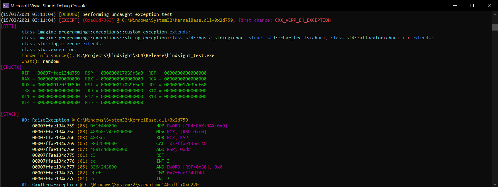

<p align="center"></p>

# hindsight
A debugger with a postmortem (JIT) mode for Windows that can be used in conjunction with debug symbol files (.pdb) on Windows to record and investigate exceptions and crashes in already published software.


## Features
Hindsight is not a fully featured debugger that can be used for advanced debugging of software in development phase. Hindsight is a portable debugger that can be run by the end-user to generate a report on some of the behaviour of the program being debugged. The most notable events this debugger is interested in, are breakpoints and exceptions. 

* Exception and breakpoint registering with resolved addresses to the source module;
* RTTI for MSVC++ Exceptions (0xe06d7363);
* Full CPU context when the latter occurs (state of CPU registers);
* Full stack trace with resolved addresses to the source modules of each frame;
* PDB support, determining full symbol names, source file names and line numbers; (<sup>1</sup>)
* The possibility to output to standard out;
* The possibility to output to binary form, for later relisting (i.e. record, send and replay);
* A postmortem mode for Windows versions that support the AeDebug registry key with the `JIT_DEBUG_INFO` reference.

<sup>1</sup> - the line numbers are estimates, because the compiler might generate optimized code or make other decisions that slightly offset the line number associations. In the stack trace, the auxiliary frames might show the line numbers of the instructions after the one we're interested in, because of the way the stack frames are built up (we travel back through return addresses, which is usually the location of the call + 1 instruction). The line number, source file and symbol name information is only available if the module exports the symbols and a PDB file is included.

## Installation
Clone the repository and build the solution in Visual Studio 2019. The build yields a single statically linked binary, hindsight.exe, which you can deploy to any system supporting it. There is no installation for this project, considering it is meant to be shipped to the end user. If you would like to have hindsight available in your command line, simply add its directory to `PATH` - this might be useful if you want to replay binary log files.

## Usage Examples
### Debug a live session to terminal
... with breaking on first-chance exceptions and breakpoints enabled, printing thread contexts and timestamps and adding the path of the debugged application to the symbol lookup directory. Aside from this, allow 5 recursive frames before cutting it in the output and disassemble 5 instructions at the address of each frame in the stack trace:

```bash
hindsight -s launch -Sbefct -r5 -i5 <path_to_program.exe>
```

### Debug a user session to binary log file
... excluding the -ct flags as they are automatically recorded in the binary format:

```bash
hindsight -w C:\Users\$username\Documents\hindsight-binlogs\$image\crash_$date_$time_$random.hind launch -S -r5 -i5 "H:\Software\Some-Legacy-Program.exe" "param1" "param2"
```

### A Postmortem session using AeDebug
... see the source for a registry file on registering hindsight as postmortem debugger. Also notify the user when a program crashes and indicate the paths to the log files, so that they know what to send to the developer or administrator:

```bash
path\to\hindsight.exe -w C:\Users\$username\Documents\hindsight-binlogs\$image\crash_$date_$time_$random.hind mortem -Sn -r5 -i5 -p %ld -e %ld %j %p
```

## Remarks
Ensure that when you want to use hindsight in your on site exception logging to include the appropriate PDB file in the deployment. Rebuild the project in release mode with the `/DEBUG` linker option and the `/Zi` compiler option.

If you cannot get the postmortem debugger to show up on the client systems, be sure to disable "Prevent display of the user interface for critical errors" in group policies Computer Configuration &gt; Administrative Templates &gt; Windows Components &gt; Windows Error Reporting (either local or domain).

## Dependencies
Hindsight depends on a couple of third-party libraries. These libraries have been included in this repository, so that anyone can just build this solution off the bat without having to worry about collecting those. 

* [CLI11](https://github.com/CLIUtils/CLI11)
* [rang](https://github.com/agauniyal/rang)
* [distorm](https://github.com/gdabah/distorm)

Aside from this, Hindsight only runs on 64 bit Windows systems, capable of debugging 32-bit (WOW64) and 64-bit processes. The DbgHelp DLL, usually installed on Windows, is a requirement. Including this DLL in your deployment to the end-user is recommended, to be sure the version you know supports the features hindsight requires are available for the user.

## Support
Open an issue on GitHub or @ me, [@BGroothedde](https://twitter.com/BGroothedde)

## Development Setup
Simply clone and open the solution in Visual Studio. A compiled version of distorm is included, but building distorm is trivial as they ship a solution file with a static library configuration as well.

## Release History
- **0.6.2.0alpha**:
    - added a flag to the replay subcommand that enables pausing the terminal after the replay, keeping it open. This might be useful in file-associations (open-with).
- **0.6.1.0alpha**:
    - quick fix of RTTI information indentation.
- **0.6.0.0alpha**:
    - complete rework of the CLI-argument logic by implementing DynaCli on top of [CLI11](https://github.com/CLIUtils/CLI11) like in [tiffconvert](https://github.com/Imagine-Programming/tiffconvert);
    - added RTTI for MSVC++ EH Exceptions (0xe06d7363) recording the type-chain of the catchable types, exception messages and throwing modules.
- **0.5.0.0alpha**:
    - initial public source release;
    - 32-bit build configuration;
    - changes in binary log file logic, `PROCESS_INFORMATION` can no longer just be written as is due to size differences.
- **0.4.4.1alpha**:
    - no more use of `new` and `delete`.
- **0.4.3.1alpha**: 
    - fix the use of `GetUserNameA` to account for the NUL character being counted.
- **0.4.2.1alpha**: 
    - fix the use of `std::string::find` in the path placeholders.
- **0.4.1.1alpha**: 
    - initial alpha release.

## Meta
- Author: Bas Groothedde ([@BGroothedde](https://twitter.com/BGroothedde), [Blog](https://www.xoru.net))
- Contributors: 
    - Lisa Marie (Logo)

## Documentation
For now, there are two forms of docs - a wiki would be nice in the future:

- `hindsight --help-all`
- XML Comments in code, nothing generated from them yet as the support for C++ XML comments is not that good at the moment.

## Contributing
Everyone is welcome to contribute, but please open an issue first to discuss the change you'd like to make. Anything is fine: bug fixes, additions, changes in logic and changes in behaviour. Only the logo is not going to change, probably ... just open an issue first, because I'd like to monitor and co-decide on changes, as this project is actively used in an enterprise environment.

Please follow the same code style as seen in the current source, changes to the style can obviously discussed. Don't use `new`, `delete`, an allocation function and `free`. Use `std::vector`, `std::array`, `std::unique_ptr` and `std::shared_ptr` or stack allocated instances. 

- Fork the project;
- Create a feature branch (`git checkout -b feature/name`);
- Update the [Version.hpp](./hindsight/Version.hpp) file as described in the comments, add yourself to the contributors list.
- Commit your changes (`git commit -am 'Add some name'`), please use descriptive messages in your commits;
- Push to the branch (`git push origin feature/name`);
- Create a new Pull Request.

## Desired additions
- Tests, preferably unit tests;
- Code review / cleanup, it has been developed in a high pace - so there are many best practises to add;
- Bug fixes;
- New useful features that can benefit the core purpose of hindsight: looking back at on site crashes.

## Built With
- Visual Studio 2019, Enterprise on Windows 10 Professional.

## License
[MIT License](LICENSE.md)
